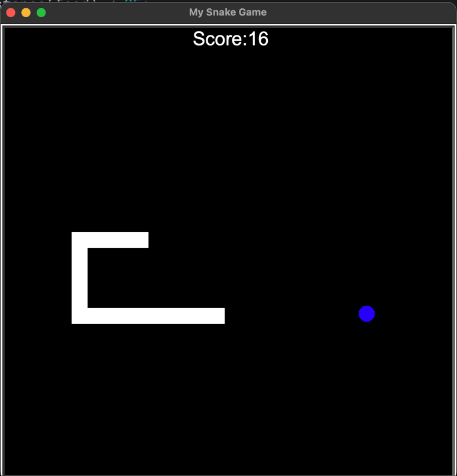

# Snake Game in Python

A classic implementation of the Snake game built using Python and the Turtle graphics library. This project was completed as part of Dr. Angela Yu's "100 Days of Code: The Complete Python Pro Bootcamp" on Udemy.

## About The Project

This project demonstrates fundamental Python programming and game development concepts. It is structured using object-oriented principles, with separate classes for the Snake, Food, and Scoreboard to manage the game's logic and state.

## Screenshot




## Requirements

To run this game, you will need Python installed on your system. The `turtle` module is part of the standard Python library, so no external packages are needed.

*   Python 3.x

## How to Run the Game

1.  **Clone the repository:**
    ```bash
    git clone https://github.com/dheerajdhami2001-cyber/snake_game.git
    ```
2.  **Navigate to the project directory:**
    ```bash
    cd snake_game
    ```
3.  **Run the main game file:**
    ```bash
    python main.py
    ```

## Controls

*   **Up Arrow:** Move up
*   **Down Arrow:** Move down
*   **Left Arrow:** Move left
*   **Right Arrow:** Move right

## Acknowledgments

*   This project was built by following the curriculum of the **[100 Days of Code: The Complete Python Pro Bootcamp](https://www.udemy.com/course/100-days-of-code/)** by Dr. Angela Yu. A huge thank you to her for the excellent instruction and comprehensive course material.
